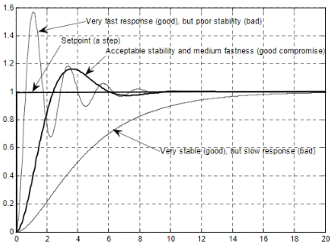

# Understanding PID Controllers in Microcontroller-Based Control Systems

## Overview

This document aims to provide a comprehensive understanding of PID (Proportional-Integral-Derivative) controllers, specifically in the context of microcontroller-based control systems. Whether you're a student embarking on the journey of studying microcontrollers and control algorithms or someone seeking a detailed exploration of PID controllers, this guide is tailored to meet your needs.

## PID Controller Basics

### Proportional (P) Term

The proportional term is an immediate response to the current error, representing the difference between the desired and actual values. By being proportional to the present error, it effectively reduces steady-state error.

### Integral (I) Term

The integral term accounts for accumulated past errors over time. This is essential for eliminating any residual steady-state error that might persist with the proportional term alone.

### Derivative (D) Term

The derivative term anticipates future system behavior by considering the rate of change of the error. It plays a crucial role in damping oscillations and improving the system's transient response.

## Microcontrollers and PID

In the realm of microcontrollers, PID controllers find widespread application for precise control of systems such as temperature, speed, or position. Here's a breakdown of how PID is generally implemented in microcontroller-based systems:

### Sensor Input

The microcontroller reads input from a sensor that measures the current state of the system. This could include temperature sensors, position sensors, or any relevant feedback device.

### Error Calculation

The microcontroller calculates the error by comparing the desired setpoint with the actual measured value from the sensor.

### PID Computation

Utilizing the proportional, integral, and derivative terms, the microcontroller performs computations to generate a control signal. This signal is instrumental in adjusting the system to bring it closer to the desired setpoint.
[more...](https://www.pid-tuner.com/pid-control/)

### Actuator Output

The computed control signal is then sent to an actuator, which could be a motor, heater, or any relevant output device. The actuator influences the system, aiming to align it with the desired setpoint.

### Iterative Process

This entire process is iterative, with the microcontroller continuously adjusting the system based on the feedback loop. This iterative nature ensures that the system dynamically stays close to the desired setpoint.

## Advantages

- **Versatility:** PID controllers are adaptable to a wide range of systems.
- **Stability and Responsiveness:** They provide stability and responsiveness, crucial in applications like robotics and automation.

    

## Challenges

- **Parameter Tuning:** Tuning the PID parameters can be a challenge, requiring a deep understanding of the specific system dynamics.

## Conclusion

In summary, PID controllers, when implemented in microcontrollers, serve as powerful tools for achieving precise control in various applications. Whether you're delving into the world of microcontrollers or seeking a deeper understanding of control algorithms, the PID framework offers a robust and effective approach to maintaining system performance in line with desired setpoints.
