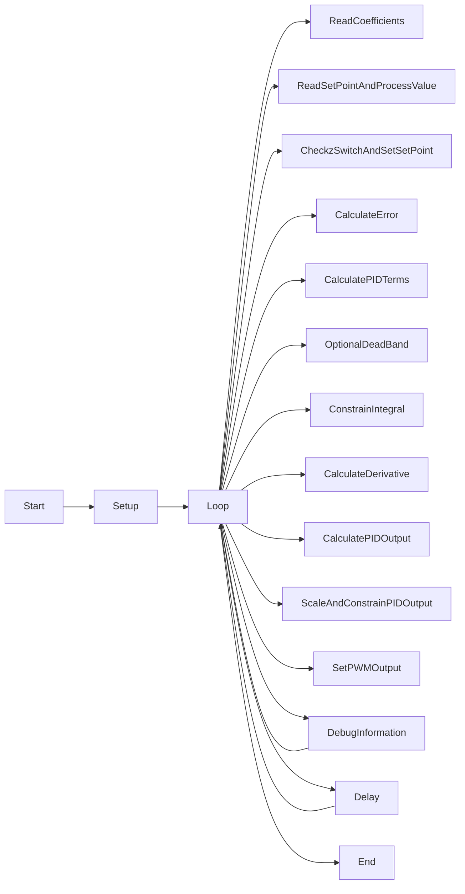

# PID Demo Program

This is a PID (Proportional-Integral-Derivative) demo program for an Arduino Pro Mini board. The program uses analog inputs to control a motor's position and implements a PID algorithm to adjust the motor's speed and maintain a desired setpoint.

## Hardware Requirements

- Arduino Pro Mini board
- Potentiometers connected to analog pins:
  - `setPointPot` (Potentiometer controlling the desired position)
  - `processValuePot` (Potentiometer connected to the motor for position feedback)
  - `Ppot` (Potentiometer controlling the Proportional gain, Kp)
  - `Ipot` (Potentiometer controlling the Integral gain, Ki)
  - `Dpot` (Potentiometer controlling the Derivative gain, Kd)
- `enableMotor` (Pin 12) connected to enable the PWM output to the motor
- `zSwitch` (Digital pin 2) as a switch to enable/disable the process value potentiometer

## Setup

1. Connect the hardware components as per the requirements mentioned above.
2. Upload the program to the Arduino Pro Mini board.
3. Open the serial monitor at a baud rate of 9600 to view the debug information.

## Program Flow

1. Initialize the serial communication and set the pin modes.
2. Configure Timer 2 for 62.5 kHz PWM to control the motor.
3. Initialize variables for PID coefficients (P, I, D), errors, and time (t_now).
4. Enter the main loop.
5. Read the PID coefficient pots and scale the coefficients (Kp, Ki, Kd) as needed.
6. Read the set point and process value pots and adjust their ranges.
7. Check the status of the zSwitch. If it is low, disable the set point pot and set a predefined set point value.
8. Calculate the error as the difference between the process value and set point.
9. Calculate the proportional, integral, and derivative terms.
10. Optionally, apply a dead band to prevent integral hunting.
11. Constrain the integral term within a specified range.
12. Calculate the derivative term as the difference between the current and previous errors.
13. Compute the PID output (pid) using the scaled coefficients.
14. Scale and constrain the pid value for valid PWM range (-127 to 127).
15. Set the PWM output to the motor based on the pid value.
16. Periodically (every 500 milliseconds), display debug information on the serial monitor.
17. Repeat the loop with a 10ms delay.

## Debug Information

The debug information displayed on the serial monitor includes the following data:

- `error`: Current error (difference between process value and set point)
- `Kp`, `Ki`, `Kd`: PID coefficient values
- `pid`: Computed PID output
- `p`, `i`, `d`: Proportional, integral, and derivative terms

## Flowchart

## Notes

- Adjust the PID coefficients (P, I, D) scaling factors as per the specific application and system requirements.
- Modify the hardware connections and pin configurations if using different components or board models.
- The flowchart represents the general flow of the code. Some details may be omitted for simplicity.

Enjoy experimenting with the PID algorithm and motor control using this demo program!
