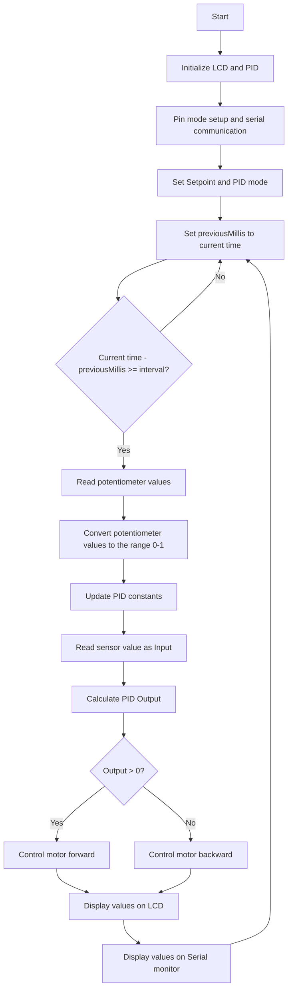

# PID-Controlled DC Motor Program

This program is an example implementation of PID (Proportional-Integral-Derivative) control for a DC motor using Arduino. PID control is employed to regulate the speed of the DC motor based on the input sensor value and a predetermined setpoint.

## Libraries Used

This program utilizes three libraries:

- Wire.h for I2C communication
- LiquidCrystal_I2C.h for controlling the display on the I2C LCD
- PID_v1.h for implementing PID control

## Initialization of Variables and Objects

The program uses various variables and objects, including:

- `lcd`: an object of the LiquidCrystal_I2C class used to control the I2C LCD display
- `Setpoint`, `Input`, and `Output`: double-type variables used as the setpoint, sensor input, and PID output values, respectively
- `kp`, `ki`, and `kd`: double-type variables serving as constants in the PID control
- `potPin1`, `potPin2`, `potPin3`, and `motorPin`: variables storing Arduino pin numbers for reading potentiometer values and controlling the DC motor speed
- `previousMillis` and `interval`: variables used to set the time interval in the program
- `myPID`: an object of the PID class used to calculate the PID output

## Setup

In the `setup()` function, several tasks are performed, such as:

- Setting `motorPin` as an output
- Opening the serial monitor with a baud rate of 9600
- Initializing the `lcd` object
- Turning on the backlight on the LCD
- Setting the Setpoint value
- Setting the PID mode to AUTOMATIC

## Loop

In the `loop()` function, various actions take place, including:

- Reading the current time
- If the specified time interval has elapsed, reading potentiometer values 1, 2, and 3
- Converting the analog values from the potentiometers to a range of 0-1
- Updating PID constants with values from the potentiometers
- Reading sensor values as input
- Calculating the PID output using the input value, setpoint, and PID constants
- Controlling the DC motor with the PID output
- Displaying input, output, and constants on the LCD
- Displaying input, output, and constants on the serial monitor

## Conclusion

This concludes the PID-controlled DC motor program on Arduino. Feel free to modify and customize the program according to your needs. Hope you find it beneficial!

## Flowchart

